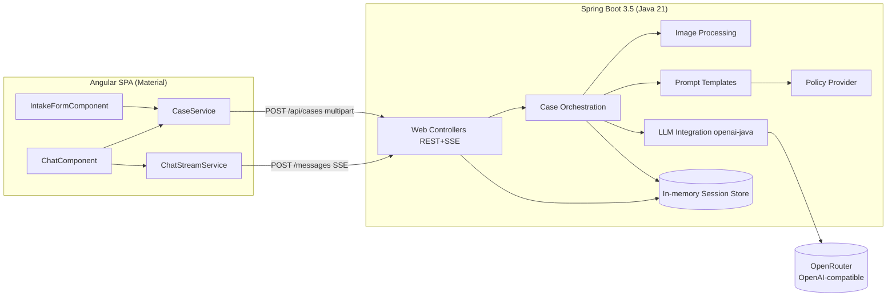
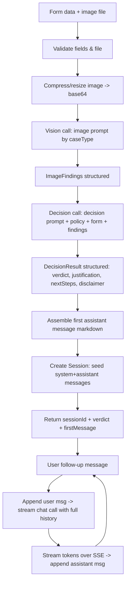
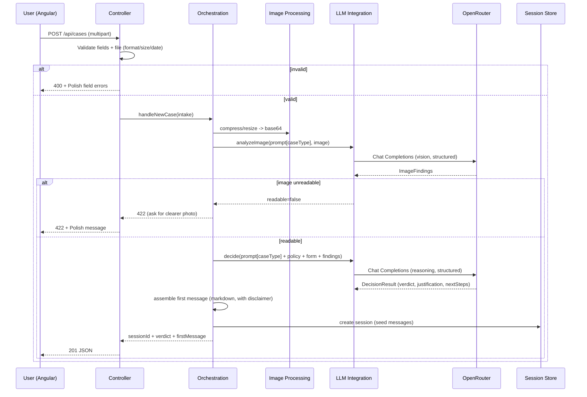
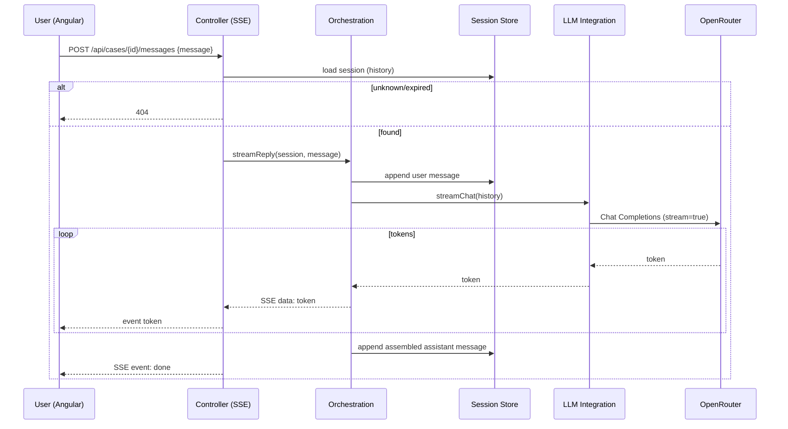
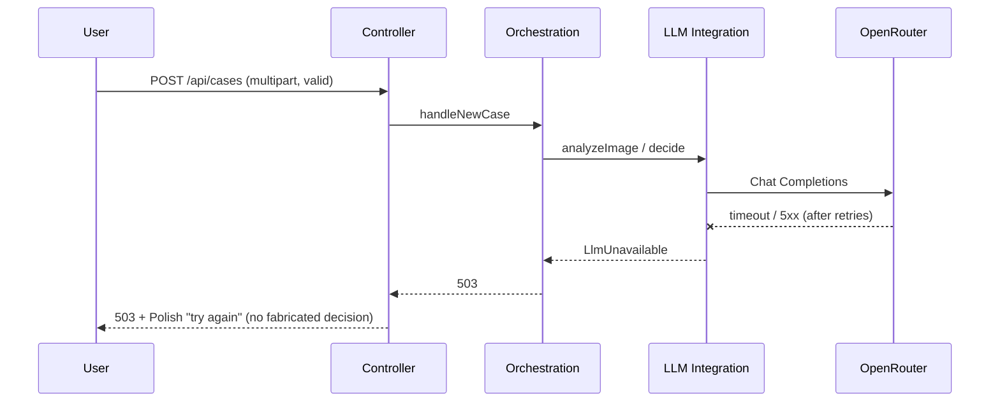

# ADR: Hardware Service Decision Copilot — Main Architecture

**Date:** 2026-06-24
**Status:** Accepted
**PRD:** [`docs/PRD-Product-Requirements-Document.md`](../PRD-Product-Requirements-Document.md)

---

## 1. Overview

This ADR set defines the technical architecture for the **Hardware Service Decision Copilot** MVP described in the PRD: a self-service web app where a customer submits a complaint/return intake form with one device photo, the backend runs a two-stage LLM pipeline (multimodal image analysis → policy-grounded decision), and the customer then continues in a streaming chat with an agent that holds full case context.

This document (ADR-000) covers the overall system: architecture pattern, repository layout, technology stack, module map, data models, top-level API contracts, environment variables, cross-cutting decisions, system diagrams, and the overall testing strategy. Area-specific detail is delegated to:

- [`001-backend-api.md`](001-backend-api.md) — Spring Boot REST + SSE, request handling, image compression, session orchestration.
- [`002-llm-integration.md`](002-llm-integration.md) — openai-java + OpenRouter, two-stage pipeline, prompts, structured outputs, streaming.
- [`003-frontend.md`](003-frontend.md) — Angular + Angular Material intake form and chat UI, SSE consumption.
- [`004-persistence-and-backlog.md`](004-persistence-and-backlog.md) — in-memory state for MVP, designed SQLite schema and the deferred backlog (history, persistence, RAG, employee console).

---

## 2. Context7 Library References

Implementing agents must use these handles to fetch docs.

> **Environment note:** the Context7 MCP API key in this workspace is currently invalid (`resolve-library-id` returns "Invalid API key"). Configure a valid `ctx7sk…` key before relying on Context7; the handles below are the canonical `/org/repo` IDs and should resolve once the key is set. The openai-java repository was confirmed via the official GitHub (`github.com/openai/openai-java`).

| Library | Context7 Handle | Used for |
|---|---|---|
| Spring Boot | `/spring-projects/spring-boot` | Backend framework: REST controllers, multipart upload, validation, SSE, scheduling, virtual threads. |
| OpenAI Java SDK | `/openai/openai-java` | LLM client (pointed at OpenRouter): chat completions, multimodal image input, structured outputs, streaming. |
| Angular | `/angular/angular` | Frontend SPA framework: standalone components, router, reactive forms, HttpClient, fetch-based SSE. |
| Angular Components (Material + CDK) | `/angular/components` | UI components: form fields, select, datepicker, button, progress, chips, cards, layout. |
| ngx-markdown | `/jfcere/ngx-markdown` | Render the agent's markdown-formatted messages in the chat. |
| Thumbnailator | `/coobird/thumbnailator` | Server-side image resize/compression before sending to the multimodal model. |

OpenRouter is consumed as an OpenAI-compatible HTTP API, not a Context7 library. Reference docs: OpenRouter OpenAI-SDK guide (`openrouter.ai/docs/guides/community/openai-sdk`), Chat Completions (`openrouter.ai/docs/api/reference`), Responses API beta (`openrouter.ai/docs/api/reference/responses/overview`), Streaming (`openrouter.ai/docs/api/reference/streaming`).

---

## 3. System Architecture

### Architecture pattern
Single-page application (Angular) + stateless-per-process REST/SSE backend (Spring Boot), in a **monorepo**. The backend orchestrates a two-stage LLM pipeline against OpenRouter and relays streaming chat over Server-Sent Events. No database in the MVP — session and conversation state live in server memory.

### Repository structure
```
app/
  backend/      Spring Boot 3.5 (Maven) — REST + SSE API, LLM orchestration, in-memory session store
    src/main/java/...        application code (controllers, services, model, config)
    src/main/resources/      application.yml, prompt templates, bundled policy docs
    src/test/java/...        unit + integration tests
    pom.xml
  frontend/     Angular + Angular Material SPA — intake form + chat
    src/app/...              standalone components, services, models
    proxy.conf.json          dev proxy /api -> backend
    package.json, angular.json
docs/
  PRD-Product-Requirements-Document.md
  ADR/                       this folder
  policies/                  return-policy.md, complaint-policy.md (source of truth; copied into backend resources at build or read at runtime)
```
Frontend and backend are developed and run independently in local dev (Angular dev server proxies `/api` to Spring Boot). No build-time coupling in the MVP.

### Technology stack

| Layer | Technology | Reason |
|---|---|---|
| Backend runtime | Java 21 (LTS) | Current LTS; virtual threads simplify blocking SSE/LLM relay. |
| Backend framework | Spring Boot 3.5.x (Spring MVC, servlet) | Mature REST + multipart + SSE (`SseEmitter`) support; team-standard for this NBP edition. |
| Build (backend) | Maven | Requested; standard Spring Boot tooling. |
| LLM client | OpenAI Java SDK (`com.openai:openai-java`) | Official SDK; base-URL override targets OpenRouter; supports image input, structured outputs, streaming. |
| LLM gateway | OpenRouter (OpenAI-compatible Chat Completions) | Single key for many models; drop-in OpenAI compatibility; model swappable via config. |
| Image processing | Thumbnailator (+ Java ImageIO) | Simple, reliable server-side resize/re-encode before the multimodal call. |
| Frontend framework | Angular (standalone components) | Requested; strong typed forms, DI, HttpClient. |
| Frontend UI kit | Angular Material + CDK | Requested; provides all form/chat primitives. |
| Markdown rendering | ngx-markdown | Render the formatted agent messages safely. |
| State store (MVP) | In-process memory (concurrent map + TTL eviction) | PRD defers persistence; keeps MVP simple. SQLite designed in ADR-004 for later. |

---

## 4. Module Structure & Dependencies

### Backend modules (packages)
- **web (controllers)** — exposes REST + SSE endpoints; performs request binding and validation; maps domain errors to Polish user-facing error payloads. Depends on: case-orchestration, session-store. Depended on by: nothing.
- **case-orchestration (service)** — the core flow: validate → compress image → image-analysis call → decision call → assemble first message → create session; and chat-turn handling (append message, stream reply). Depends on: image-processing, llm-integration, prompt-templates, policy-provider, session-store.
- **llm-integration** — wraps the OpenAI Java SDK configured for OpenRouter; exposes two operations: analyze-image (structured) and decide (structured), plus stream-chat (token stream). Depends on: config. Depended on by: case-orchestration.
- **image-processing** — validates and compresses/resizes the uploaded image; produces a base64 data payload within model limits. Depends on: config. Depended on by: case-orchestration.
- **prompt-templates** — loads and fills the four prompt templates (return/complaint × image/decision) and the chat system prompt. Depends on: policy-provider. Depended on by: case-orchestration.
- **policy-provider** — supplies the relevant policy document text by case type. Depends on: config/resources. Depended on by: prompt-templates.
- **session-store** — in-memory store of sessions (case data, image findings, verdict, full message history) with TTL eviction. Depends on: nothing. Depended on by: web, case-orchestration.
- **config** — typed configuration (OpenRouter key/base-url/models, image limits, session TTL). Depends on: nothing.

Dependency direction is strictly inward toward `case-orchestration` and downward to `llm-integration`/`image-processing`/`session-store`. No circular dependencies.

### Frontend modules
- **IntakeFormComponent** — the form screen; reactive form + validation; submits multipart. Depends on: CaseService, metadata.
- **ChatComponent** — the chat screen; renders messages (markdown), verdict, streaming reply, errors. Depends on: CaseService, ChatStreamService.
- **CaseService** — HTTP: submit case (multipart), fetch metadata. Depends on: HttpClient.
- **ChatStreamService** — opens the SSE/streaming chat connection (fetch + ReadableStream) and emits tokens. Depends on: browser fetch.
- **models** — shared TypeScript types mirroring backend DTOs.

Routing: `/` → IntakeFormComponent; `/chat/:sessionId` → ChatComponent.

---

## 5. Data Models

Conceptual models (no schema code). MVP stores these **in memory**; ADR-004 maps them to a SQLite schema for the backlog.

- **CaseType** — enum: `COMPLAINT` (reklamacja), `RETURN` (zwrot).
- **EquipmentCategory** — enum/code with Polish label; from the fixed list in PRD §8.
- **Verdict** — enum: `APPROVE`, `REJECT`, `NEEDS_INFO`, `ESCALATE` (Polish labels: Zatwierdzone / Odrzucone / Wymaga uzupełnienia / Eskalacja do specjalisty).
- **CaseIntake** — the submitted form: caseType, category, modelName, purchaseDate, reason (required for complaint), and the uploaded image (transient binary; not retained after analysis in the MVP). Purpose: input to the pipeline.
- **ImageFindings** — structured result of the multimodal call: readable (bool), for complaints {damagePresent, damageType, likelyCauseCategory}, for returns {signsOfUse, resellable}, plus a free-text description and a confidence indicator. Purpose: input to the decision call; shown to no one raw.
- **DecisionResult** — structured result of the decision call: verdict, justification (text), nextSteps (ordered list), discrepancyNoted (bool + note), and the mandatory disclaimer text. Purpose: source for the first chat message.
- **ChatMessage** — role (`system` | `assistant` | `user`), content (text/markdown), createdAt. Purpose: conversation history (the `system` and first `assistant` messages are seeded by the pipeline).
- **Session** — sessionId (opaque), caseIntake summary (no raw image), imageFindings, decisionResult, full ordered ChatMessage list, createdAt/expiresAt. Purpose: holds everything needed for follow-up chat turns and the case summary panel. Persistence: in-memory map, evicted after TTL (default 2h) or on restart.

---

## 6. API / Interface Contracts

Conceptual contracts; full detail in ADR-001. All user-facing error messages are Polish; no stack traces or raw model payloads are ever returned (AC-29).

### POST `/api/cases`
- **Purpose:** submit the intake form, run the two-stage pipeline, return the first decision.
- **Input:** `multipart/form-data` — `caseType` (COMPLAINT|RETURN), `category` (code), `modelName` (string), `purchaseDate` (ISO date, not future), `reason` (string; required when COMPLAINT), `image` (file: JPEG/PNG/WebP, ≤10 MB).
- **Output (201):** `{ sessionId, caseSummary{caseType, category, modelName, purchaseDate}, verdict, firstMessage (markdown string) }`.
- **Errors:** `400` field validation (per-field Polish messages); `422` image unreadable → instruction to re-upload (not a verdict); `503` LLM unavailable (retriable). Image–case contradiction is **not** an error — it returns `200/201` with verdict `NEEDS_INFO`/`ESCALATE` and the discrepancy stated.
- **Notes:** synchronous; may take several seconds (two LLM calls); the first decision is delivered whole (not streamed). No auth.

### POST `/api/cases/{sessionId}/messages`
- **Purpose:** send a follow-up chat message and stream the agent reply.
- **Input:** JSON `{ message: string }`.
- **Output:** `text/event-stream` — a sequence of token events (`data:` chunks) followed by a terminal `done` event; the full reply is appended to session history server-side.
- **Errors:** `404` unknown/expired session; `503` LLM unavailable (sent as an error event; conversation preserved); `400` empty message.
- **Notes:** consumed in the browser via fetch + ReadableStream (not `EventSource`, because the request carries a body). No auth.

### GET `/api/metadata`
- **Purpose:** supply form option lists (case types, equipment categories) with Polish labels.
- **Output (200):** `{ caseTypes[], categories[] }`.

### GET `/api/health`
- **Purpose:** liveness; returns `200` when the app is up. Does not call OpenRouter.

---

## 7. Environment Variables

| Variable | Purpose | Required | Example value |
|---|---|---|---|
| `OPENROUTER_API_KEY` | OpenRouter API key (primary) | Yes | `sk-or-v1-…` |
| `OPENAI_API_KEY` | Fallback key if OpenRouter key absent (per AGENTS.md) | No | `sk-…` |
| `OPENROUTER_BASE_URL` | OpenAI-compatible base URL | No (default) | `https://openrouter.ai/api/v1` |
| `OPENROUTER_MODEL_VISION` | Model ID for the multimodal image-analysis call | No (default) | `openai/gpt-4o` |
| `OPENROUTER_MODEL_REASONING` | Model ID for the decision ("thinking") call and chat | No (default) | `anthropic/claude-sonnet-4` |
| `OPENROUTER_APP_TITLE` | Sent as `X-Title` header (OpenRouter attribution) | No | `Hardware Service Decision Copilot` |
| `OPENROUTER_APP_REFERER` | Sent as `HTTP-Referer` header | No | `http://localhost:4200` |
| `APP_IMAGE_MAX_BYTES` | Max accepted upload size (server-side guard) | No (default) | `10485760` |
| `APP_SESSION_TTL_MINUTES` | In-memory session lifetime | No (default) | `120` |

> Model IDs are intentionally configurable (decision in §8). Example values are placeholders; pick currently available OpenRouter models at run time. The exact `.env.example` is permission-restricted in this workspace but AGENTS.md confirms `OPENROUTER_API_KEY` / `OPENAI_API_KEY` as the key names.

---

## 8. Technical Decisions

### Use OpenRouter Chat Completions (not the Responses API) for the MVP
**Status:** Accepted
**Date:** 2026-06-24
**Context:** The PRD needs multimodal image analysis, a structured decision verdict, and multi-turn chat. We must choose between OpenRouter's Chat Completions and its Responses API (beta).
**Decision:** Use **Chat Completions** via the OpenAI Java SDK pointed at OpenRouter. It is mature, has the strongest OpenRouter compatibility, and fully supports base64 image input, JSON-schema structured outputs, and SSE streaming. OpenRouter's Responses API is beta **and stateless** (no server-side conversation persistence), so it offers no state-management benefit — we keep history ourselves regardless (and must, per PRD).
**Rejected alternatives:**
- Responses API (beta): newer, richer reasoning ergonomics, but beta status is a risk for a course MVP and brings no statefulness advantage on OpenRouter.
- Mixed (Completions for image, Responses for chat): more moving parts, two integration shapes to maintain.
**Consequences:**
- (+) Stable, well-documented, single integration shape; easy model swapping.
- (+) Structured outputs map cleanly to Java records via the SDK's `responseFormat`.
- (-) We own conversation-history assembly and token budgeting.
**Review trigger:** Revisit if we need server-side threads/stateful tools, native multi-tool reasoning loops, or if OpenRouter's Responses API leaves beta and offers concrete benefits.

### Point the official OpenAI Java SDK at OpenRouter
**Status:** Accepted
**Date:** 2026-06-24
**Context:** Java backend needs an LLM client; OpenRouter is OpenAI-compatible.
**Decision:** Use `com.openai:openai-java` with `baseUrl = OPENROUTER_BASE_URL` and `apiKey = OPENROUTER_API_KEY`, plus OpenRouter attribution headers. One client, two structured operations + one streaming operation.
**Rejected alternatives:**
- Spring AI: heavier abstraction; the group chose the OpenAI SDK directly for transparency and control in the course context.
- Raw HTTP/WebClient: re-implements serialization, structured outputs, streaming parsing.
**Consequences:** (+) Official, maintained client with structured-output + streaming helpers. (-) Slight coupling to OpenAI SDK request/response shapes (mitigated by OpenRouter compatibility).
**Review trigger:** If we adopt Spring AI for RAG/tooling later, or if SDK/OpenRouter compatibility breaks.

### Two-stage pipeline: multimodal analysis → reasoning decision
**Status:** Accepted
**Date:** 2026-06-24
**Context:** PRD §11 specifies separate image analysis and a thinking-model decision grounded in policy.
**Decision:** Keep two distinct calls. Call 1 (vision model) returns **structured ImageFindings**. Call 2 (reasoning model) takes form data + findings + the relevant policy document and returns a **structured DecisionResult**. Models are independently configurable.
**Rejected alternatives:** single multimodal call doing both (less separation, harder to ground in policy and to swap a cheaper vision model); collapsing to text-only (loses image evidence).
**Consequences:** (+) Clear separation, independent model/cost tuning, testable stages. (-) Two round-trips → higher latency for the first message (acceptable; delivered whole with a progress indicator).
**Review trigger:** If first-message latency exceeds acceptable demo bounds, consider a single multimodal decision call.

### Stream follow-up chat over SSE; deliver the first decision whole
**Status:** Accepted
**Date:** 2026-06-24
**Context:** PRD wants a responsive chat with a typing indicator; the first message requires two sequential calls.
**Decision:** Deliver the first decision as one complete message after a progress indicator. Stream **follow-up** replies token-by-token via `text/event-stream`, consumed in the browser with fetch + ReadableStream.
**Rejected alternatives:** stream everything (the two-stage first message is awkward to stream coherently); no streaming (worse UX, and the user explicitly wants streaming).
**Consequences:** (+) Best UX/complexity balance. (-) Two response modes to implement (JSON for submit, SSE for chat).
**Review trigger:** If we later stream partial decision reasoning, or move to WebSockets for bidirectional needs.

### In-memory session state for the MVP; SQLite designed but inactive
**Status:** Accepted
**Date:** 2026-06-24
**Context:** PRD §7/§12 defer persistence; backlog wants SQLite sessions/audit.
**Decision:** Hold sessions in a concurrent in-memory map with TTL eviction. Fully design the SQLite schema + repository boundary in ADR-004 so it can be enabled without restructuring (the session-store interface is the seam).
**Rejected alternatives:** wire SQLite now (pulls a backlog item into MVP scope); no abstraction (would force rework later).
**Consequences:** (+) Minimal MVP; clean upgrade path. (-) State lost on restart; not multi-instance safe (acceptable for MVP).
**Review trigger:** When persistence/audit (backlog item 2) is scheduled, or when more than one backend instance is needed.

### Monorepo with independent local dev servers + dev proxy
**Status:** Accepted
**Date:** 2026-06-24
**Context:** One repository hosts backend + frontend; the course runs locally.
**Decision:** `app/backend` (Spring Boot, port 8080) and `app/frontend` (Angular dev server, port 4200) run independently; the Angular dev proxy forwards `/api` to the backend. No containers in the MVP.
**Rejected alternatives:** Docker Compose (more setup overhead for live coding); single jar with Angular baked in (slower frontend iteration during the course).
**Consequences:** (+) Fast iteration, clear separation. (-) Two processes to start; CORS handled via proxy in dev.
**Review trigger:** When packaging for a shared/staging deploy.

### Custom Angular Material chat UI (+ ngx-markdown)
**Status:** Accepted
**Date:** 2026-06-24
**Context:** Ready-made Angular chat libraries are commercial SaaS (Stream, Syncfusion) and don't fit a self-hosted AI backend.
**Decision:** Build a lightweight chat from Angular Material primitives consuming our own SSE stream; render formatted agent messages with ngx-markdown.
**Rejected alternatives:** Stream Chat Angular (hosted SaaS, external accounts/cost); Syncfusion Chat UI (commercial license, heavy).
**Consequences:** (+) No SaaS dependency, full control, exact backend fit. (-) We build/maintain the chat components.
**Review trigger:** If chat requirements grow well beyond MVP (reactions, attachments, presence).

---

## 9. Diagrams

### 9.1 Architecture / Component Diagram


### 9.2 Data Flow Diagram


### 9.3 Sequence Diagrams

#### Form submission and AI analysis (happy path)


#### Follow-up chat (streaming)


#### Error path — LLM unavailable


---

## 10. Testing Strategy

### Philosophy
TDD per AGENTS.md: write/extend tests before production code; new tests must first fail for the expected reason. The external LLM (OpenRouter) is mocked at the HTTP boundary in unit/integration tests; E2E uses the real stack (qa-engineer). Verification per changed scope: backend `mvn test` + app start; frontend unit tests + `ng build`.

### Test layers

| Layer | Type | Scope | Tools |
|---|---|---|---|
| Unit (BE) | All deps mocked | Validation, image compression, prompt assembly, policy selection, structured-output mapping, session store TTL, error mapping | JUnit 5, Mockito, AssertJ |
| Unit (FE) | All deps mocked | Reactive-form validation (incl. conditional reason, future-date, file format/size), services, markdown render binding, verdict labeling | Karma/Jasmine (Angular default) or Jest |
| Integration (BE) | Only external LLM mocked | Controller + orchestration with a mock OpenRouter server: multipart submit, structured parsing, SSE token streaming, 400/422/503 mapping | Spring Boot Test, MockMvc/WebTestClient, MockWebServer or WireMock |
| E2E | Nothing mocked (real stack) | Full journey: form → decision → chat streaming, plus image-mismatch and unreadable-image flows | Playwright (qa-engineer) |

### Key test scenarios
- **Happy return** — RETURN + clean device image → verdict `APPROVE`; first message contains greeting, verdict, justification, next steps, disclaimer. Edge: borderline wear.
- **Happy complaint** — COMPLAINT + damaged image + reason → verdict reflects damage cause; complaint image prompt used. Edge: ambiguous cause → `NEEDS_INFO`.
- **Image contradicts case** — damaged image submitted as RETURN → verdict `NEEDS_INFO`/`ESCALATE`, discrepancy stated; returns success (not error). 
- **Unreadable image** — blurry/wrong subject → `422`, Polish "re-upload clearer photo", no verdict produced.
- **Validation** — missing image, wrong format, >10 MB, future purchase date, missing reason for complaint → `400` with specific per-field Polish messages; no LLM call made.
- **LLM unavailable** — mock 5xx/timeout → `503`, no fabricated decision, retriable.
- **Chat streaming** — follow-up message streams tokens then `done`; full history (form + findings + first message) is in the model context; reply consistent with verdict. Edge: stream error mid-reply → error event, conversation preserved.
- **Off-topic** — unrelated question → polite Polish redirect; no policy fabrication.
- **Session expiry** — message to expired/unknown session → `404`.
- **No leakage** — error responses never include stack traces, prompts, or raw model payloads.

### Technical acceptance criteria
- **TAC-01:** `POST /api/cases` rejects non-JPEG/PNG/WebP and >10 MB files with `400` and a Polish per-field message; no OpenRouter call is made.
- **TAC-02:** A future `purchaseDate` and a missing `reason` for `COMPLAINT` each produce `400` with a field-specific Polish message.
- **TAC-03:** The image is resized/re-encoded to within configured limits before any LLM call (verified by inspecting the outbound mock request payload size/dimensions).
- **TAC-04:** The vision call uses the complaint image prompt for `COMPLAINT` and the return image prompt for `RETURN`; the decision call injects the matching policy document text.
- **TAC-05:** The decision call returns a structured object deserialized to a `DecisionResult` whose `verdict` is exactly one of `APPROVE|REJECT|NEEDS_INFO|ESCALATE`.
- **TAC-06:** When ImageFindings indicate the image contradicts the declared case, the response verdict is `NEEDS_INFO` or `ESCALATE` and the justification text references the discrepancy.
- **TAC-07:** When the mock OpenRouter returns unreadable-image findings, the API responds `422` and produces no verdict.
- **TAC-08:** When the mock OpenRouter fails after retries, the API responds `503` and the session/chat is not opened with a decision.
- **TAC-09:** The first assistant message always contains the mandatory Polish disclaimer string.
- **TAC-10:** `POST /api/cases/{id}/messages` responds with `text/event-stream`, emits ≥1 token event and a terminal `done` event, and the assembled assistant reply is appended to session history.
- **TAC-11:** A chat turn sends the full prior history (system + first assistant + all user/assistant turns) to the model (verified against the mock request body).
- **TAC-12:** Messages to an unknown/expired `sessionId` return `404`.
- **TAC-13:** No error response body contains a stack trace, internal prompt text, or raw provider error payload.
- **TAC-14:** App boots with only `OPENROUTER_API_KEY` set (other LLM settings fall back to documented defaults).
