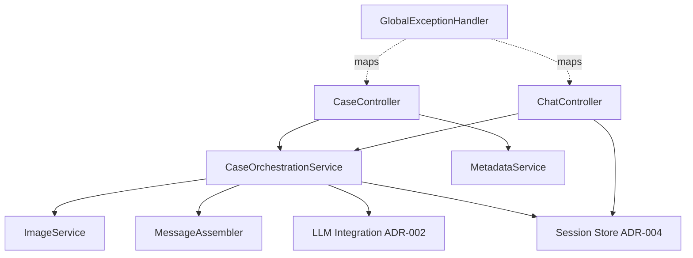
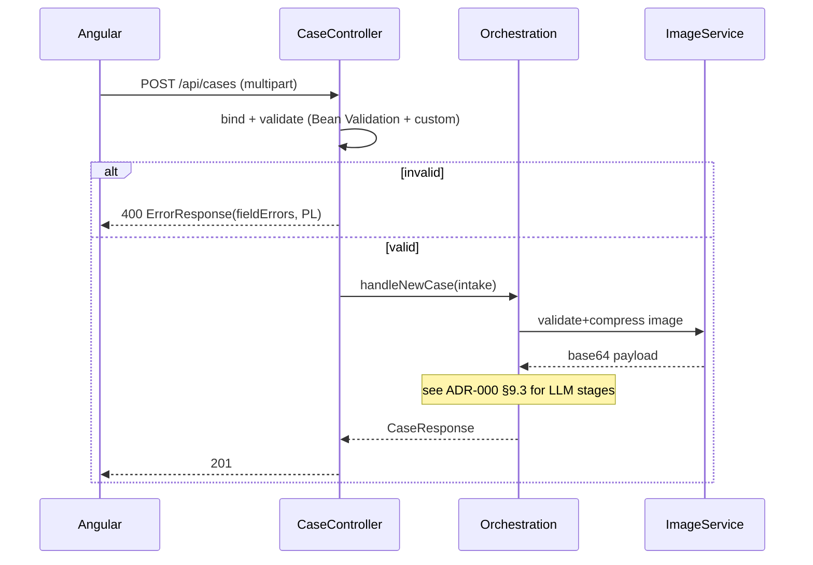

# ADR-001: Backend API & Orchestration

**Date:** 2026-06-24
**Status:** Accepted
**Relates to:** [`000-main-architecture.md`](000-main-architecture.md)

---

## 1. Scope

Covers the Spring Boot backend: REST + SSE endpoints, request binding/validation, image-upload handling and compression hand-off, the case-orchestration flow, error model, and configuration. Does **not** cover the LLM client internals/prompts (ADR-002), the frontend (ADR-003), or persistence design (ADR-004).

---

## 2. Context7 References

| Library | Context7 Handle | Used for |
|---|---|---|
| Spring Boot | `/spring-projects/spring-boot` | Web MVC controllers, multipart, validation, `SseEmitter`, scheduling, config properties, virtual threads. |
| Thumbnailator | `/coobird/thumbnailator` | Image resize/compression. |

---

## 3. Component Design

- **CaseController** — `POST /api/cases` (multipart), `GET /api/metadata`, `GET /api/health`. Binds and validates input; delegates to orchestration; maps results/errors to HTTP + Polish payloads.
- **ChatController** — `POST /api/cases/{sessionId}/messages`; returns an `SseEmitter` (or streaming response body) fed by the orchestration's token stream; sends `token` events and a terminal `done`/`error` event.
- **CaseOrchestrationService** — coordinates: validate → `ImageService.compress` → `LlmService.analyzeImage` → branch on readability/contradiction → `LlmService.decide` → `MessageAssembler.firstMessage` → `SessionStore.create`. For chat: load session → append user message → `LlmService.streamChat` → relay tokens → append assembled assistant message.
- **ImageService** — validates MIME/extension and byte size; decodes; resizes to a max edge and re-encodes (quality target) to fit model input limits; returns a base64 data payload + content type. Rejects undecodable images (treated as validation error pre-LLM).
- **MessageAssembler** — builds the first assistant message (markdown) from `DecisionResult`: greeting, verdict (Polish label), justification, ordered next steps, disclaimer; and seeds the system message.
- **MetadataService** — returns case types and equipment categories with Polish labels.
- **SessionStore** — interface (in-memory implementation in ADR-004); create/get/append-message/evict.
- **GlobalExceptionHandler** (`@ControllerAdvice`) — maps domain exceptions (`ValidationException`, `ImageUnreadableException`, `LlmUnavailableException`, `SessionNotFoundException`) to `400/422/503/404` with a uniform Polish error body; logs internally, never leaks internals (AC-29).
- **Config / AppProperties** — typed properties for OpenRouter (key, base-url, models, headers), image limits, session TTL; virtual-threads enabled for the servlet executor to keep streaming relays cheap.

State management: only `SessionStore` holds state; controllers and services are stateless singletons.

---

## 4. Data Structures

Request/response DTOs (conceptual):
- **CaseSubmission (multipart binding):** caseType, category, modelName, purchaseDate, reason?, image (file part).
- **CaseResponse (201):** sessionId, caseSummary{caseType, category, modelName, purchaseDate}, verdict, firstMessage (markdown).
- **ChatRequest:** message (non-empty).
- **SSE events:** `token` (data = text chunk), `done` (data = end marker), `error` (data = Polish message).
- **MetadataResponse:** caseTypes[{code,label}], categories[{code,label}].
- **ErrorResponse:** code (machine string), message (Polish), fieldErrors? [{field, message}]. No stack/trace fields.

Internal domain types (CaseIntake, ImageFindings, DecisionResult, ChatMessage, Session) per ADR-000 §5; ImageFindings/DecisionResult shapes are owned by ADR-002.

---

## 5. Interface Contracts

| Endpoint | Input | Output | Errors |
|---|---|---|---|
| `POST /api/cases` | multipart: caseType, category, modelName, purchaseDate(≤today), reason(req. if COMPLAINT), image(JPEG/PNG/WebP ≤10MB) | `201` CaseResponse | `400` validation (fieldErrors, Polish); `422` image unreadable; `503` LLM unavailable |
| `POST /api/cases/{sessionId}/messages` | JSON ChatRequest | `200` `text/event-stream` token…done | `400` empty; `404` unknown/expired; `503` (as `error` event) |
| `GET /api/metadata` | — | `200` MetadataResponse | — |
| `GET /api/health` | — | `200` status | — |

Validation rules (Jakarta Bean Validation + custom): caseType ∈ {COMPLAINT,RETURN}; category ∈ fixed set; modelName non-blank (trimmed); purchaseDate present and not in the future; reason non-blank when caseType=COMPLAINT; image present, allowed MIME, ≤ `APP_IMAGE_MAX_BYTES`. Server-side limits mirror client-side (AC-08); multipart max size configured to reject oversize before buffering fully where possible.

CORS: not needed in dev (Angular proxy same-origin). A documented allowed-origin config exists for non-proxy setups.

---

## 6. Technical Decisions

### Servlet MVC + SseEmitter with virtual threads (not WebFlux)
**Status:** Accepted
**Context:** We need REST + multipart + token streaming; the team is servlet-oriented and the LLM SDK is blocking.
**Decision:** Use Spring MVC (`spring-boot-starter-web`) with `SseEmitter` for streaming; enable Java 21 virtual threads so blocking relay of LLM tokens doesn't exhaust the thread pool.
**Rejected alternatives:** WebFlux/Reactor (reactive end-to-end, but the OpenAI Java SDK is blocking and the team prefers imperative code); WebSocket (bidirectional not needed).
**Consequences:** (+) Simple imperative code, easy testing with MockMvc. (-) One thread per active stream (mitigated by virtual threads).
**Review trigger:** Very high concurrent streaming load, or adopting a fully reactive LLM client.

### POST + `text/event-stream` for chat (consumed via fetch, not EventSource)
**Status:** Accepted
**Context:** Chat turns carry a request body; `EventSource` is GET-only and bodyless.
**Decision:** Stream from a `POST` endpoint returning `text/event-stream`; the frontend reads it via fetch + ReadableStream (ADR-003).
**Rejected alternatives:** GET EventSource with the message in the query string (leaks content into URLs/logs, length limits); separate "create then GET stream" handshake (extra round-trip/state).
**Consequences:** (+) Clean single call with a body. (-) Cannot use the native `EventSource` API on the client.
**Review trigger:** If we need auto-reconnect/last-event-id semantics that `EventSource` gives for free.

### Uniform Polish error model via `@ControllerAdvice`
**Status:** Accepted
**Context:** AC-29 forbids leaking internals; all user text is Polish.
**Decision:** Central exception handler maps domain exceptions to stable codes + Polish messages; internal detail is logged server-side only.
**Rejected alternatives:** per-controller try/catch (duplication, inconsistency).
**Consequences:** (+) Consistent, safe responses. (-) Must keep the exception→status map current.
**Review trigger:** Adding auth or new error categories.

---

## 7. Diagrams

### Component diagram

### Sequence — multipart submit & validation

---

## 8. Testing Strategy

### Test scenarios for this area

| Scenario | Type | Input | Expected output | Edge cases |
|---|---|---|---|---|
| Multipart bind + validate | Integration (MockMvc) | valid/invalid form parts | 201 / 400 with PL fieldErrors | future date, blank reason for complaint, missing image |
| File guard | Unit + Integration | wrong MIME, 11 MB file | 400 PL message; no LLM call | exactly 10 MB boundary |
| Image compression | Unit | large JPEG | resized within limits, valid base64 | undecodable bytes → 400 |
| Orchestration happy | Integration (mock LLM) | valid case | 201 verdict + firstMessage incl. disclaimer | contradiction → NEEDS_INFO success |
| Unreadable image | Integration (mock LLM) | findings readable=false | 422 PL re-upload, no verdict | — |
| LLM down | Integration (mock LLM 5xx) | valid case | 503, no session opened | timeout vs 5xx |
| Chat SSE | Integration | follow-up message | text/event-stream, tokens + done | mid-stream error → error event |
| Session 404 | Integration | unknown sessionId | 404 | expired (TTL) session |
| Error leakage | Unit/Integration | forced exception | body has no stack/prompt | — |

### Technical acceptance criteria
- **TAC-001-01:** `POST /api/cases` returns `400` with `fieldErrors` (Polish) for each invalid field and makes no LLM call.
- **TAC-001-02:** Files outside JPEG/PNG/WebP or above the byte limit are rejected with `400` before image decoding completes.
- **TAC-001-03:** `ImageService` output dimensions/byte size are within configured maxima for any accepted input.
- **TAC-001-04:** `POST /api/cases/{id}/messages` sets `Content-Type: text/event-stream`, emits ≥1 `token` and a terminal `done`, or an `error` event on failure without closing the session.
- **TAC-001-05:** Unknown/expired `sessionId` → `404`; empty message → `400`.
- **TAC-001-06:** No error response contains stack traces, prompt text, or raw provider payloads.
- **TAC-001-07:** The app starts and `GET /api/health` returns `200` without contacting OpenRouter.
