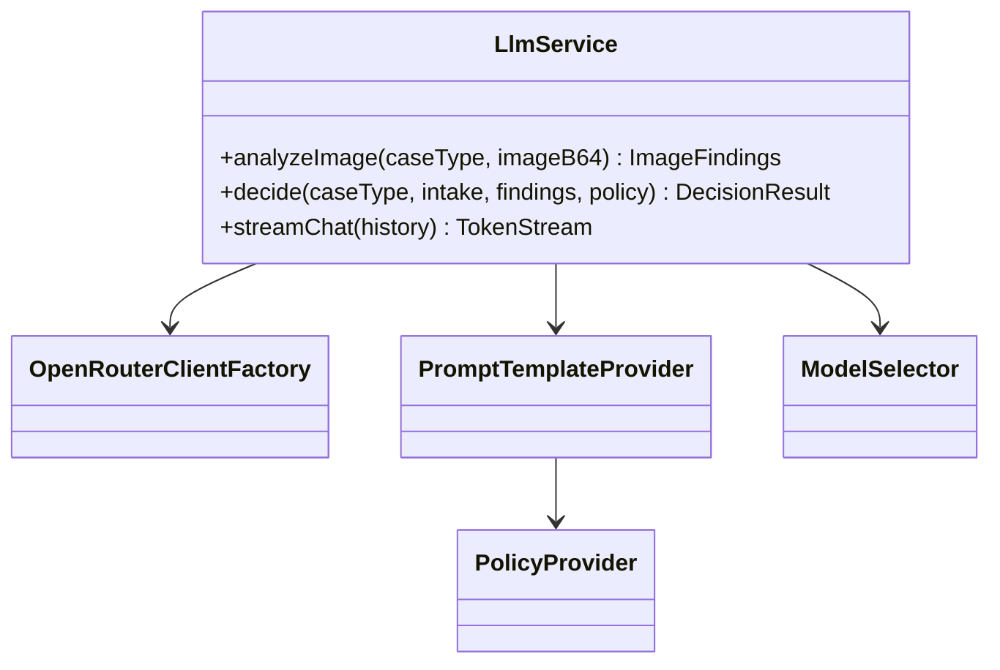
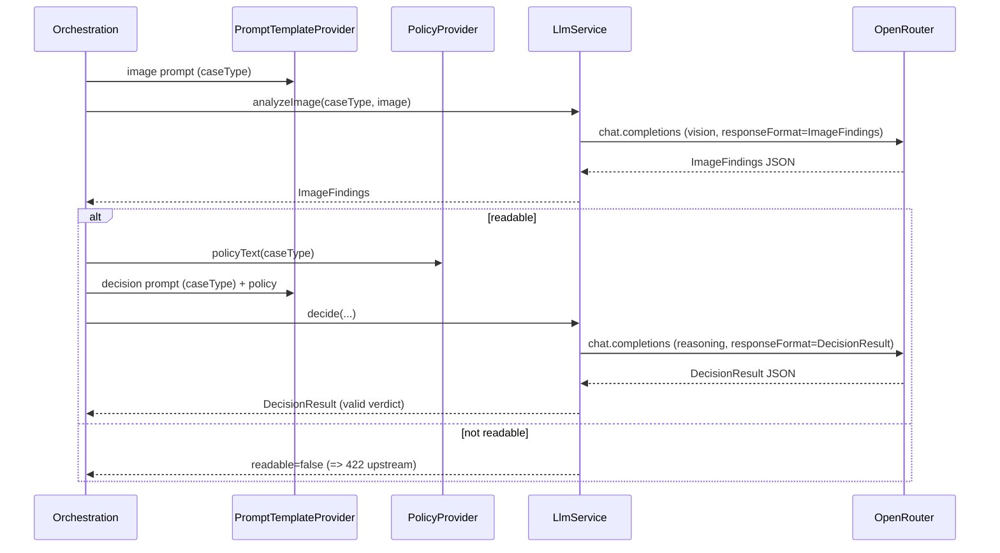
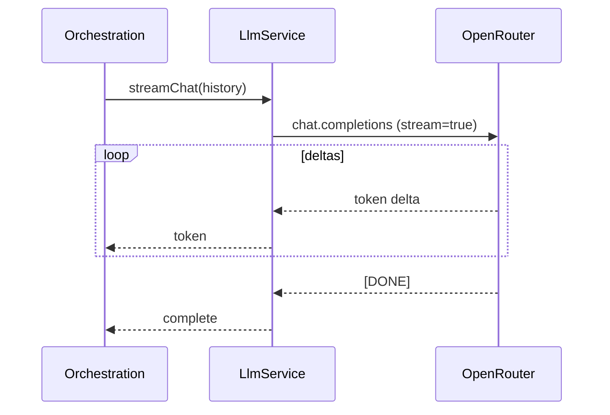

# ADR-002: LLM Integration (openai-java + OpenRouter)

**Date:** 2026-06-24
**Status:** Accepted
**Relates to:** [`000-main-architecture.md`](000-main-architecture.md)

---

## 1. Scope

Covers the LLM layer: configuring the OpenAI Java SDK against OpenRouter, the two-stage pipeline (multimodal image analysis → reasoning decision), structured outputs, streaming chat, prompt templates, policy injection, model selection, and resilience. Does **not** cover HTTP endpoints (ADR-001), UI (ADR-003), or storage (ADR-004).

---

## 2. Context7 References

| Library | Context7 Handle | Used for |
|---|---|---|
| OpenAI Java SDK | `/openai/openai-java` | Client config (baseUrl/apiKey/headers), chat completions, image content parts, `responseFormat(Class<T>)` structured outputs, streaming + accumulation. |

OpenRouter docs (HTTP, not Context7): OpenAI-SDK guide, Chat Completions reference, Streaming reference (see ADR-000 §2). Key facts established by research: OpenRouter is OpenAI-compatible at `https://openrouter.ai/api/v1`; images are passed as base64 data URLs or URLs in chat content; `stream: true` yields SSE token deltas; structured outputs via JSON schema are supported on compatible models.

---

## 3. Component Design

- **OpenRouterClientFactory** — builds one OpenAI Java client configured with `baseUrl = OPENROUTER_BASE_URL`, `apiKey = OPENROUTER_API_KEY` (fallback `OPENAI_API_KEY`), and default headers `HTTP-Referer` / `X-Title`. Timeouts and a small bounded retry (on 429/5xx/timeout) configured here.
- **LlmService** — the only abstraction the orchestration uses. Three operations:
  1. **analyzeImage(caseType, imageBase64)** → `ImageFindings` (structured). Uses the vision model and the image prompt selected by case type.
  2. **decide(caseType, intake, findings, policyText)** → `DecisionResult` (structured). Uses the reasoning model and the decision prompt selected by case type, with the policy document injected as rules.
  3. **streamChat(history)** → token stream. Uses the reasoning model with `stream=true`; the orchestration relays tokens and assembles the final assistant message.
- **PromptTemplateProvider** — holds the four templates (return/complaint × image/decision) and the chat system prompt; fills placeholders (form fields, findings, policy text, disclaimer, verdict label set). Templates are external resource files so they can be edited without code changes.
- **PolicyProvider** — returns `return-policy` text for RETURN and `complaint-policy` text for COMPLAINT (sourced from `docs/policies/*` bundled into backend resources).
- **ModelSelector** — resolves vision/reasoning model IDs from config (env-overridable), with documented defaults.
- **Mapping** — structured-output Java records define the JSON schema the SDK derives; responses deserialize directly into them. A defensive validation guards enum/required fields; malformed structured output triggers one bounded re-ask, then `LlmUnavailable`.

---

## 4. Data Structures

- **ImageFindings (structured):**
  - `readable` (bool) — false ⇒ orchestration returns `422`.
  - `description` (text) — concise human-readable summary (internal; never shown raw).
  - `signsOfUse` (bool, return-relevant), `resellable` (bool, return-relevant).
  - `damagePresent` (bool, complaint-relevant), `damageType` (enum/text), `likelyCauseCategory` (enum: MANUFACTURING | MECHANICAL | LIQUID | WEAR | UNKNOWN).
  - `matchesDeclaredCase` (bool) + `discrepancyNote` (text) — supports the contradiction rule.
  - `confidence` (LOW|MEDIUM|HIGH).
- **DecisionResult (structured):**
  - `verdict` (enum: APPROVE | REJECT | NEEDS_INFO | ESCALATE).
  - `justification` (text; must reference form data + findings + policy).
  - `nextSteps` (ordered list of short strings).
  - `discrepancyNoted` (bool) + `discrepancyExplanation` (text, when applicable).
  - `disclaimer` (text; mandatory Polish disclaimer).
- **ChatMessage list** — system prompt + seeded first assistant message + alternating user/assistant turns; sent in full each chat turn (ADR-000 decision: we own history).

All model-facing text and all generated content are **Polish**.

---

## 5. Interface Contracts

`LlmService` (conceptual):
- `analyzeImage(caseType, imageBase64Payload) -> ImageFindings` — throws `LlmUnavailable` on exhausted retries; returns `readable=false` for unanalyzable images.
- `decide(caseType, intake, findings, policyText) -> DecisionResult` — guarantees a valid `verdict`; enforces the contradiction rule (if `findings.matchesDeclaredCase=false`, verdict ∈ {NEEDS_INFO, ESCALATE} and discrepancy explained).
- `streamChat(history) -> stream<token>` — emits text deltas; signals completion; throws/relays `LlmUnavailable` as an error event.

Prompt contracts:
- **Return image prompt:** assess signs of use/damage and resellability; output strictly the ImageFindings schema.
- **Complaint image prompt:** assess damage presence/type/likely cause; output strictly the ImageFindings schema.
- **Return decision prompt:** apply the return policy to form + findings; choose a verdict; never invent rules; include disclaimer; surface discrepancies.
- **Complaint decision prompt:** apply the complaint policy similarly.
- **Chat system prompt:** the agent persona, allowed/forbidden actions (PRD §11), Polish tone, off-topic redirect, mandatory disclaimer on any (re)stated recommendation, and the frozen case context (form + findings + first decision).

---

## 6. Technical Decisions

### Structured outputs via JSON-schema-from-records
**Status:** Accepted
**Context:** Image findings and the decision must be machine-usable and reliably shaped.
**Decision:** Define Java records for `ImageFindings` and `DecisionResult`; use the SDK's `responseFormat(Class<T>)` so OpenRouter enforces the schema and the SDK deserializes directly. One bounded re-ask on malformed output, then `LlmUnavailable`.
**Rejected alternatives:** free-text + regex/JSON parsing (brittle); function/tool calling (heavier, not needed for a single structured return).
**Consequences:** (+) Deterministic shapes, less parsing code, testable. (-) Requires a structured-output-capable model on OpenRouter (documented constraint on model choice).
**Review trigger:** If a chosen model lacks JSON-schema support, or we add multi-tool reasoning.

### Configurable model IDs with documented defaults
**Status:** Accepted
**Context:** Course models change; cost/quality trade-offs differ per call.
**Decision:** `OPENROUTER_MODEL_VISION` and `OPENROUTER_MODEL_REASONING` are env-configurable; documented defaults are a capable multimodal model (vision) and a reasoning/"thinking" model (decision + chat). Both validated at startup (fail fast if blank).
**Rejected alternatives:** hard-pinned models (fragile across the course); one model for both (less tuning headroom).
**Consequences:** (+) Easy swaps, per-stage tuning. (-) Defaults must be kept to currently-available IDs.
**Review trigger:** Provider deprecations or cost/latency issues.

### Bounded retry + fail-closed (no fabricated decisions)
**Status:** Accepted
**Context:** PRD forbids fabricated decisions on failure (AC-22), and transient OpenRouter errors happen.
**Decision:** Small bounded retry with backoff on 429/5xx/timeout; on exhaustion raise `LlmUnavailable` (→ `503` / SSE `error`). Never synthesize a verdict locally.
**Rejected alternatives:** infinite retry (hangs UX); degrade to form-only decision (user chose fail-closed).
**Consequences:** (+) Honest failures, safe behavior. (-) Some recoverable-after-wait cases surface as errors (acceptable; user retries).
**Review trigger:** If provider reliability warrants a queue/async retry.

---

## 7. Diagrams

### Component / class diagram

### Sequence — two-stage pipeline

### Sequence — streaming chat turn

---

## 8. Testing Strategy

### Test scenarios for this area

| Scenario | Type | Input | Expected output | Edge cases |
|---|---|---|---|---|
| Client config | Unit | env set | client uses OpenRouter baseUrl + key + headers | key fallback to OPENAI_API_KEY |
| Prompt selection | Unit | caseType RETURN/COMPLAINT | correct image+decision prompt chosen | — |
| Policy injection | Unit | caseType | matching policy text present in decision prompt | missing policy resource fails fast |
| Image findings mapping | Integration (mock OpenRouter) | schema JSON | deserialized ImageFindings | malformed JSON → one re-ask → LlmUnavailable |
| Decision mapping | Integration (mock) | schema JSON | valid verdict enum | invalid enum → re-ask |
| Contradiction rule | Unit/Integration | findings.matchesDeclaredCase=false | verdict NEEDS_INFO/ESCALATE + discrepancy | — |
| Unreadable | Integration (mock) | readable=false | propagated (→422) | — |
| Retry/fail-closed | Integration (mock 429→5xx) | transient errors | bounded retry then LlmUnavailable | success on 2nd try |
| Streaming | Integration (mock SSE) | token deltas | ordered tokens + completion | mid-stream error surfaced |
| Disclaimer present | Unit | DecisionResult | disclaimer field non-empty Polish | — |

### Technical acceptance criteria
- **TAC-002-01:** The client targets `OPENROUTER_BASE_URL` with `OPENROUTER_API_KEY` (or `OPENAI_API_KEY` fallback) and sets `HTTP-Referer`/`X-Title` headers.
- **TAC-002-02:** `analyzeImage` sends the image as a base64 content part with the case-type-correct image prompt and requests the `ImageFindings` schema.
- **TAC-002-03:** `decide` includes the matching policy document text and requests the `DecisionResult` schema; the returned `verdict` is a valid enum value.
- **TAC-002-04:** If `matchesDeclaredCase=false`, `decide` yields `NEEDS_INFO` or `ESCALATE` with a non-empty discrepancy explanation.
- **TAC-002-05:** Malformed structured output triggers exactly one bounded re-ask before raising `LlmUnavailable`.
- **TAC-002-06:** Transient 429/5xx/timeout are retried up to the configured bound, then raise `LlmUnavailable`; no verdict is ever fabricated.
- **TAC-002-07:** `streamChat` emits tokens in order and a completion signal; an upstream stream error is surfaced (not swallowed).
- **TAC-002-08:** Startup fails fast if vision/reasoning model IDs or the API key are blank.
