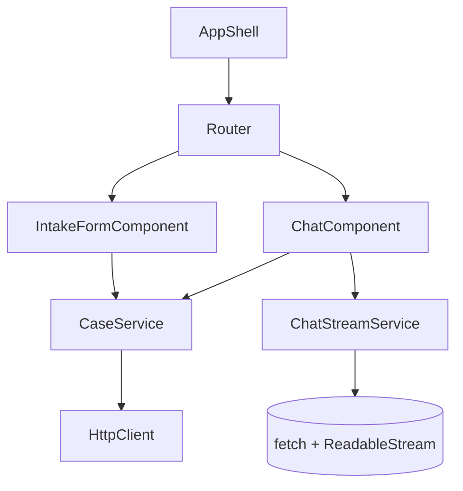
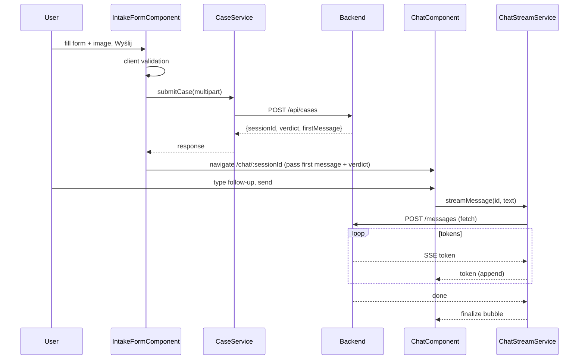

# ADR-003: Frontend (Angular + Angular Material)

**Date:** 2026-06-24
**Status:** Accepted
**Relates to:** [`000-main-architecture.md`](000-main-architecture.md)

---

## 1. Scope

Covers the Angular SPA: intake form screen, chat screen, services (HTTP + streaming), routing, validation, markdown rendering, and dev proxy. Does **not** cover backend endpoints (ADR-001), LLM internals (ADR-002), or storage (ADR-004).

---

## 2. Context7 References

| Library | Context7 Handle | Used for |
|---|---|---|
| Angular | `/angular/angular` | Standalone components, router, reactive forms, HttpClient, signals. |
| Angular Components (Material + CDK) | `/angular/components` | Form field, select, datepicker, input, button, progress-spinner/bar, chips, card, toolbar, layout. |
| ngx-markdown | `/jfcere/ngx-markdown` | Render the agent's markdown messages. |

---

## 3. Component Design

- **App shell** — Material toolbar + router outlet; Polish UI strings throughout (AC-28).
- **IntakeFormComponent** (route `/`) — reactive form with Angular Material controls:
  - Case type: `mat-radio-group`/segmented (Reklamacja / Zwrot).
  - Category: `mat-select` populated from `/api/metadata` (Polish labels).
  - Model name: `matInput` text.
  - Purchase date: `mat-datepicker` with `max=today` (future dates disabled).
  - Reason: `matInput textarea`; validator toggles **required** when case type = Reklamacja.
  - Image: custom upload (file input + CDK drag-drop), thumbnail preview, remove button, helper text (accepted formats + 10 MB); client-side validation of MIME + size.
  - Submit button "Wyślij" disabled until valid; on submit shows a progress state with a status message; on success navigates to `/chat/:sessionId`.
- **ChatComponent** (route `/chat/:sessionId`) — message list (scroll, autoscroll on new), collapsible case-summary header (type, category, model, purchase date, thumbnail), verdict chip (color-coded by verdict), markdown-rendered assistant messages, user input + send, typing indicator while streaming, inline error + retry on stream failure (conversation preserved). The first assistant message is provided by the submit response and rendered immediately; it is not re-fetched.
- **CaseService** — `submitCase(formData)` → POST `/api/cases` (multipart) returns `{sessionId, caseSummary, verdict, firstMessage}`; `getMetadata()`; maps backend `ErrorResponse` to display.
- **ChatStreamService** — `streamMessage(sessionId, text)` opens a `fetch` POST to `/api/cases/{id}/messages`, reads the `ReadableStream`, parses SSE `token`/`done`/`error` events, and emits tokens (e.g. as an Observable/Signal) for incremental rendering.
- **models** — TypeScript interfaces mirroring backend DTOs and the verdict enum with Polish labels.

State: component-local via signals; `sessionId` is the source of truth carried in the route. No global store needed for the MVP. If the user lands on `/chat/:id` without in-memory `firstMessage` (e.g. refresh), show a notice and offer to start over (MVP has no server fetch of history).

---

## 4. Data Structures

- **CaseFormValue:** caseType, category, modelName, purchaseDate (Date), reason, imageFile (File).
- **CaseResponse:** sessionId, caseSummary, verdict, firstMessage (markdown).
- **ChatMessageVM:** role (`assistant`|`user`), text (markdown for assistant), streaming (bool), error? (string).
- **Verdict enum + label map:** APPROVE→Zatwierdzone, REJECT→Odrzucone, NEEDS_INFO→Wymaga uzupełnienia, ESCALATE→Eskalacja do specjalisty (with distinct chip colors).
- **Metadata:** caseTypes[], categories[] (code+label).

---

## 5. Interface Contracts

Consumes backend contracts (ADR-001 §5):
- `GET /api/metadata` on form init → populate selects.
- `POST /api/cases` (multipart) → navigate to chat with the returned first message + verdict + summary.
- `POST /api/cases/{id}/messages` (fetch streaming) → append a streaming assistant bubble; finalize on `done`; show inline error on `error`.

Client-side validation mirrors server rules: required fields, conditional reason for complaint, future-date block, image MIME ∈ {JPEG,PNG,WebP}, size ≤ 10 MB. Client validation is UX-only; the server re-validates (ADR-001).

Dev proxy: `proxy.conf.json` maps `/api` → `http://localhost:8080`; `ng serve` runs with `--proxy-config`.

---

## 6. Technical Decisions

### Standalone components + signals
**Status:** Accepted
**Context:** Modern Angular; small app.
**Decision:** Use standalone components (no NgModules) and signals for local state; reactive forms for the intake form.
**Rejected alternatives:** NgModule architecture (unnecessary ceremony); template-driven forms (weaker validation control).
**Consequences:** (+) Less boilerplate, modern idioms. (-) Team must be on a recent Angular version.
**Review trigger:** If shared cross-feature state grows (consider a store).

### fetch + ReadableStream for SSE (not EventSource)
**Status:** Accepted
**Context:** Chat stream is a POST with a body (ADR-001 decision).
**Decision:** Consume the stream via `fetch` + `ReadableStream`, parsing SSE frames manually; expose tokens as a signal/observable.
**Rejected alternatives:** native `EventSource` (GET-only, no body); WebSocket (not needed).
**Consequences:** (+) Works with POST bodies, full control. (-) Manual SSE frame parsing; no built-in reconnect.
**Review trigger:** If we need auto-reconnect/last-event-id.

### Custom Material chat + ngx-markdown (no SaaS chat lib)
**Status:** Accepted (mirrors ADR-000)
**Context:** Ready-made Angular chat libs are commercial SaaS, wrong fit for our backend.
**Decision:** Build the chat from Material primitives; render agent markdown with ngx-markdown (sanitized).
**Consequences:** (+) Full control, no external accounts. (-) We own the components.
**Review trigger:** Chat scope expands well beyond MVP.

---

## 7. Diagrams

### Component diagram

### Sequence — submit then chat

---

## 8. Testing Strategy

### Test scenarios for this area

| Scenario | Type | Input | Expected output | Edge cases |
|---|---|---|---|---|
| Form validity | Unit | each field valid/invalid | submit enabled only when valid | conditional reason for complaint |
| Future date block | Unit | tomorrow | invalid + message | today allowed |
| Image client validation | Unit | wrong type / 11 MB | error message, no submit | exactly 10 MB |
| Submit success | Unit (mock service) | valid form | navigates to chat, renders first message + verdict chip | — |
| Submit error mapping | Unit | 400/422/503 | shows Polish error, stays on form (or re-upload hint) | — |
| Streaming render | Unit (mock stream) | token sequence | incremental bubble then finalized | mid-stream error → inline retry |
| Markdown render | Unit | markdown content | sanitized HTML; no script execution | — |
| Verdict labels/colors | Unit | each verdict | correct Polish label + chip color | — |
| E2E journey | E2E (Playwright) | full real flow | form→decision→streamed chat | image mismatch, unreadable image |

### Technical acceptance criteria
- **TAC-003-01:** Submit is disabled until the reactive form is valid; reason is required iff case type = Reklamacja.
- **TAC-003-02:** The datepicker blocks future dates; client rejects non-JPEG/PNG/WebP and files > 10 MB with a Polish message before any request.
- **TAC-003-03:** On a successful submit the app navigates to `/chat/:sessionId` and renders the first assistant message (markdown) and the verdict chip with the correct Polish label.
- **TAC-003-04:** Backend `400/422/503` responses are shown as Polish messages without exposing raw payloads.
- **TAC-003-05:** A follow-up message renders an incrementally streaming assistant bubble that finalizes on `done`; a stream `error` shows an inline retry and preserves the conversation.
- **TAC-003-06:** Agent markdown is rendered sanitized (no script execution).
- **TAC-003-07:** All visible labels, buttons, and errors are in Polish; `ng build` succeeds with no errors.
