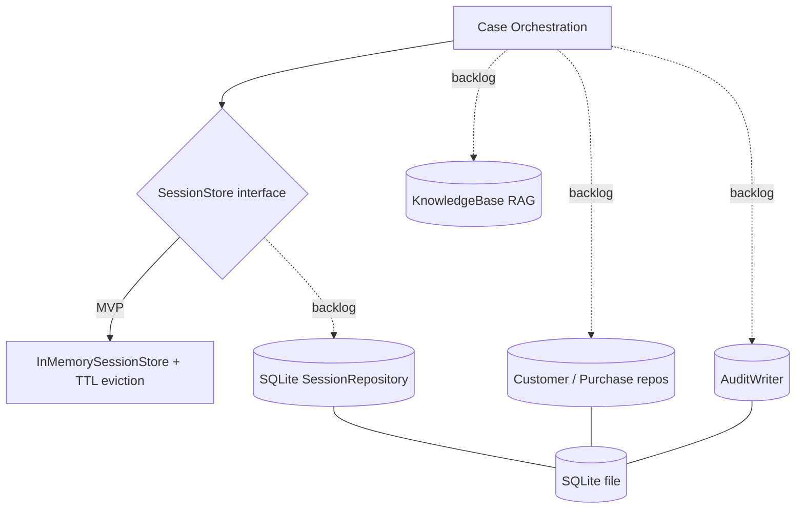
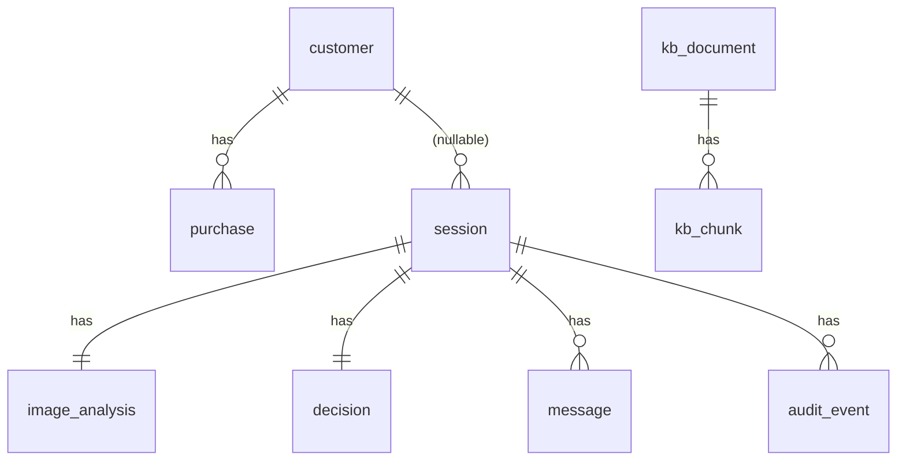

# ADR-004: Persistence (MVP in-memory) & Designed Backlog

**Date:** 2026-06-24
**Status:** Accepted
**Relates to:** [`000-main-architecture.md`](000-main-architecture.md)

---

## 1. Scope

Covers MVP state storage (in-memory session store) and the **designed-but-inactive** persistence/backlog so the architecture can adopt it without rework: SQLite schema, customer & purchase-history lookup, full session/decision audit, RAG knowledge base, and the employee console. Does **not** activate any of these in the MVP.

---

## 2. Context7 References

| Library | Context7 Handle | Used for |
|---|---|---|
| Spring Boot | `/spring-projects/spring-boot` | Scheduling (TTL eviction) in MVP; Spring Data JDBC/JPA when persistence is activated. |

> Persistence-activation libraries (SQLite JDBC driver, a Spring Data module, a vector store) are deferred. Resolve their Context7 handles when the corresponding backlog item is scheduled.

---

## 3. Component Design

### MVP (active)
- **SessionStore (interface)** — `create(session)`, `get(sessionId)`, `appendMessage(sessionId, message)`, `touch/expire`. This interface is the seam for future persistence.
- **InMemorySessionStore (implementation)** — concurrent map keyed by opaque `sessionId`; values hold case summary (no raw image bytes), `ImageFindings`, `DecisionResult`, and the full `ChatMessage` list.
- **SessionEvictionJob** — scheduled task removing sessions past `expiresAt` (`APP_SESSION_TTL_MINUTES`, default 120). State is volatile: lost on restart; single-instance only.

### Backlog (designed, inactive)
- **Persistent SessionRepository** — a SQLite-backed implementation of the same `SessionStore` seam (plus query methods), swapped in via configuration with no change to orchestration.
- **CustomerRepository / PurchaseHistoryRepository** — read existing customer + purchase data (SQLite) to enrich decision context (e.g. confirm purchase, compute warranty/return window numerically).
- **AuditWriter** — append-only record of every session event (submission, image findings summary, decision, each chat turn, errors) for review/analytics.
- **KnowledgeBase (RAG)** — retrieval over electronics specs and detailed procedures; injected as additional grounding into the decision/chat prompts.
- **Employee console** — read/confirm/override queue built on the persisted sessions + audit.

---

## 4. Data Structures

### MVP in-memory (active)
- **Session** (ADR-000 §5) held in memory; **uploaded image bytes are not retained** after analysis (privacy-by-default for the MVP).

### Designed SQLite schema (inactive — for backlog activation)
Conceptual tables (no DDL):
- **customer** — id, name, email/phone, created_at. (Backlog item 1.)
- **purchase** — id, customer_id→customer, product_name, category, purchased_at, order_ref. Enables purchase confirmation + return-window math.
- **session** — id (uuid), case_type, category, model_name, purchase_date, reason, customer_id? (nullable), created_at, expires_at, status.
- **image_analysis** — id, session_id→session, readable, description, structured_findings (json), confidence, created_at. (Stores findings, not necessarily the raw image; image retention is a separate privacy decision.)
- **decision** — id, session_id→session, verdict, justification, next_steps (json), discrepancy_noted, created_at.
- **message** — id, session_id→session, role, content, created_at, sequence.
- **audit_event** — id, session_id→session, event_type, payload (json), created_at. (Backlog item 2 — full audit trail.)
- **kb_document / kb_chunk (+ embedding)** — RAG store; chunk text + vector + source metadata. (Backlog item 3.)

Relationships: customer 1—* purchase; session *—1 customer (nullable in MVP); session 1—1 image_analysis; session 1—1 decision; session 1—* message; session 1—* audit_event.

---

## 5. Interface Contracts

- **MVP:** `SessionStore` as in §3; no external storage I/O; no customer data.
- **Backlog activation:** the same `SessionStore` seam gains a persistent implementation; new read-only repositories (`CustomerRepository`, `PurchaseHistoryRepository`) feed the orchestration's decision-context assembly; `AuditWriter.record(event)` is called at each lifecycle step; `KnowledgeBase.retrieve(query)` augments prompts. None of these are wired in the MVP.

---

## 6. Technical Decisions

### In-memory now, persistence behind a stable seam
**Status:** Accepted
**Context:** PRD defers persistence; we must not block later adoption.
**Decision:** Implement only `InMemorySessionStore` for the MVP; define `SessionStore` so a SQLite implementation drops in by config. Design the full schema now (this ADR) so the migration is mechanical.
**Rejected alternatives:** persist now (scope creep); no seam (forces rework).
**Consequences:** (+) Minimal MVP, clean upgrade. (-) No durability/multi-instance until activated.
**Review trigger:** Scheduling backlog item 1 or 2, or needing multi-instance/durable sessions.

### Do not retain raw image bytes in the MVP
**Status:** Accepted
**Context:** Privacy; PRD flags image retention as an open question for when persistence lands.
**Decision:** The MVP keeps only the derived `ImageFindings`, never the original image, after analysis.
**Rejected alternatives:** keep images in memory/disk (privacy exposure with no MVP benefit).
**Consequences:** (+) Lower privacy risk. (-) Cannot re-run analysis on the original later (acceptable for MVP).
**Review trigger:** When persistence + a documented retention/consent policy are introduced.

### SQLite as the planned persistence engine
**Status:** Accepted (for the backlog)
**Context:** PRD names SQLite for history/audit; single-node, file-based, zero-ops fits the course.
**Decision:** Target SQLite for backlog items 1–2 via a Spring Data module; keep the schema in §4 as the contract.
**Rejected alternatives:** Postgres/MySQL (heavier ops for a PoC); embedded H2 (less representative of the chosen target).
**Consequences:** (+) Simple, portable. (-) Limited concurrency/scale (fine for PoC).
**Review trigger:** Production scale or concurrent-writer needs.

---

## 7. Diagrams

### MVP vs backlog (seam)

### Designed schema (ERD — inactive)

---

## 8. Testing Strategy

### Test scenarios for this area

| Scenario | Type | Input | Expected output | Edge cases |
|---|---|---|---|---|
| Create/get session | Unit | new session | retrievable by id; full history present | unknown id → empty/None |
| Append message | Unit | user/assistant msgs | ordered history preserved | concurrent appends safe |
| TTL eviction | Unit | session past expiresAt | removed by job; get → not found | not-yet-expired retained |
| No image retention | Unit | after analysis | session holds findings, not raw bytes | — |
| Seam swappability | Unit | alternate store impl | orchestration works unchanged against the interface | — |

### Technical acceptance criteria
- **TAC-004-01:** A created session is retrievable with its full message history until it expires.
- **TAC-004-02:** Sessions past `expiresAt` are evicted and subsequently yield "not found" (→ `404` upstream).
- **TAC-004-03:** Concurrent `appendMessage` calls preserve order and lose no messages.
- **TAC-004-04:** After image analysis, the stored session contains `ImageFindings` but no original image bytes.
- **TAC-004-05:** Orchestration depends only on the `SessionStore` interface (a substitute implementation requires no orchestration change) — verified by a test double.
