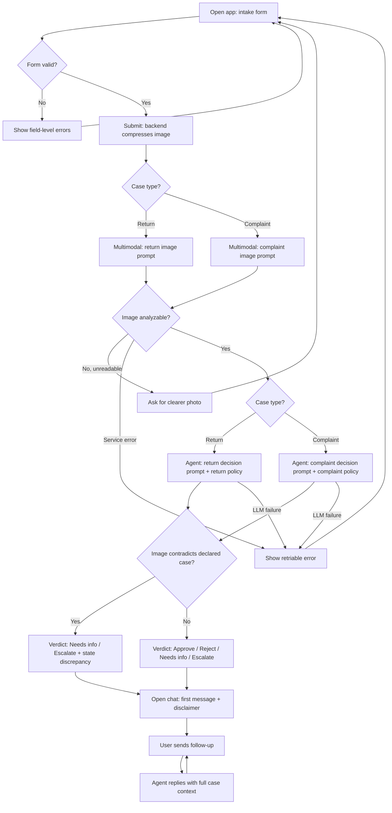

# PRD — Hardware Service Decision Copilot

> Status: MVP / PoC
> Audience: developer agent that will produce the ADR and implement the application.
> Language note: this document is written in English. **All user-facing application text is in Polish** (see Section 8).

---

## 1. Executive Summary

The Hardware Service Decision Copilot is a self-service web application (MVP/PoC) that helps a customer initiate an electronics **complaint** (reklamacja) or **return** (zwrot), upload a photo of the device, and receive an immediate, well-justified **preliminary recommendation** generated by an AI agent. The customer first completes a short structured form (including a required photo), then continues in a chat interface where the agent has the full case context. The copilot is a **decision-support tool that produces a recommendation only** — the final, binding decision is always made and recorded by a company employee. The MVP validates the end-to-end flow: form → image analysis → policy-grounded recommendation → conversational follow-up.

---

## 2. Problem Statement

When a customer wants to complain about or return an electronics product, the current process is slow and opaque. The customer fills in scattered information, the photo and description are reviewed manually, and the customer waits — often days — for a human to assess the case against return/complaint policy. The customer does not know up front whether their case is likely valid, what evidence is needed, or what the next steps are. Support staff repeatedly perform the same routine triage (is the device damaged? does the damage match the description? is the case within the return window? does the device qualify for resale?) before a decision can be made. There is no fast, consistent, policy-grounded first assessment that sets correct expectations and gathers complete information before a human gets involved.

---

## 3. Users / Personas

### Persona 1 — Anna, the returning customer (primary)
Bought a product online, changed her mind, and wants to return it within the withdrawal window. She is not damaged-aware of policy details. She wants to know quickly: *"Can I return this, and what do I do next?"* She expects a clear yes/no/what-now answer and to not be tricked or stonewalled.

### Persona 2 — Marek, the complaint customer (primary)
His device developed a fault. He is frustrated and wants it repaired, replaced, or refunded. He uploads a photo of the defect and describes what happened. He wants to understand whether his complaint is likely to be accepted, what the basis is, and what happens next. He may push back or add details in chat.

### Persona 3 — Katarzyna, the service employee (secondary)
A support/service staff member who ultimately confirms or overrides the copilot's recommendation. She is not a direct user of the MVP UI, but the product exists to make her eventual decision faster and more consistent. The recommendation, its justification, and the case data must be clear enough for her to act on. (Her tooling/queue is out of scope for the MVP — see Section 7.)

---

## 4. Main Flows

### 4.1 Happy path — Return (zwrot), device in resellable condition
1. Customer opens the app and lands on the intake form.
2. Customer selects case type **Return**, picks an equipment category, enters model name, picks purchase date, optionally writes a reason, and uploads one photo.
3. Customer submits the form. The system validates all required fields.
4. The backend compresses the image and sends it to the multimodal LLM using the **return-scenario image prompt** (assess whether the device shows any signs of use/damage and whether it is resellable).
5. The backend passes the image description + form data + the company **return policy document** to the decision agent using the **return-scenario decision prompt**.
6. The agent returns a verdict (**Approve / Reject / Needs info / Escalate**) with a structured justification and next steps.
7. The app transitions to the chat interface and renders the agent's first message: greeting, decision, plain-language explanation, next steps, and the mandatory non-binding disclaimer.
8. The customer can ask follow-up questions; the agent answers with full case context.

### 4.2 Happy path — Complaint (reklamacja), device damaged
1. Same as 4.1 steps 1–3, but case type is **Complaint**; the reason field is **required**.
2. The backend compresses the image and sends it to the multimodal LLM using the **complaint-scenario image prompt** (identify whether/how the device is damaged and the likely cause — e.g. manufacturing defect vs. mechanical/liquid/user-induced damage).
3. The backend passes the image description + form data + the company **complaint policy document** to the decision agent using the **complaint-scenario decision prompt**.
4. The agent returns a verdict with justification and next steps; the chat opens with the first message (as in 4.1 step 7).
5. The customer continues in chat (e.g. adds purchase proof details, asks about repair vs. replacement).

### 4.3 Alternative — Image contradicts the declared case
1. During analysis the image clearly contradicts the declared scenario (e.g. visibly damaged device submitted as a no-damage return, or no visible defect for a complaint).
2. The agent does **not** silently re-decide. It produces a **Needs info** (or **Escalate**) verdict, explicitly states the discrepancy in the justification, and asks the customer to clarify or provide a better photo / more detail.

### 4.4 Alternative — Ambiguous or unreadable image
1. The multimodal LLM cannot confidently assess the image (blurry, too dark, wrong subject).
2. The system does not fabricate a decision. The customer is asked to re-upload a clearer photo before a recommendation is produced.

### 4.5 Error path — AI service unavailable
1. The multimodal or decision LLM call fails or times out.
2. The system shows a clear error message and lets the customer retry. No recommendation is fabricated and the chat is not opened with a decision.

### 4.6 Error path — Form validation failure
1. A required field is missing/invalid (including: no reason for a complaint, no image, unsupported file, oversized file).
2. The form blocks submission and shows a specific, field-level error message. No backend call is made.

---

## 5. User Stories

1. **(Happy — return)** As a customer returning a product, I want to submit my details and a photo and immediately learn whether my return is likely acceptable and what to do next, so that I don't have to wait days for a manual reply.
2. **(Happy — complaint)** As a customer filing a complaint, I want the system to look at my photo and description and tell me whether my complaint has a basis and on what grounds, so that I understand my situation before contacting support.
3. **(Follow-up chat)** As a customer, I want to ask the agent follow-up questions and add information after the first decision, so that I can clarify my case without re-filling the form, and have the agent remember everything I already provided.
4. **(Invalid input)** As a customer, I want clear, specific error messages when I miss a required field or upload an invalid image, so that I can correct the problem and proceed.
5. **(Image mismatch)** As a customer who uploaded a photo that doesn't match my stated case, I want the agent to tell me what looks inconsistent and what it needs, instead of giving me a wrong yes/no, so that I can provide the right evidence.
6. **(Service failure)** As a customer, I want a clear "try again later" message if the system can't analyze my case right now, so that I am not given a fabricated or misleading decision.
7. **(Trust / human oversight)** As a customer, I want to know that this is a preliminary assessment and that a person will confirm the final decision, so that I have correct expectations.
8. **(Employee value)** As a service employee, I want each case to arrive with a clear recommendation, its justification, and complete case data, so that I can confirm or override it quickly and consistently.

---

## 6. Acceptance Criteria

### Form
- **AC-01** The form presents a case-type selector with exactly two options: Complaint (reklamacja) and Return (zwrot).
- **AC-02** The form presents an equipment-category selector populated from a predefined list (see Section 8 Functional).
- **AC-03** The model/name field is a free-text input and is required (non-empty after trimming whitespace).
- **AC-04** The purchase-date field is a date picker and is required; it must not allow a date in the future.
- **AC-05** The reason field is a multi-line text input; it is **required when case type = Complaint** and optional when case type = Return.
- **AC-06** Exactly one image upload is required; submission is blocked with a specific message if no image is attached.
- **AC-07** The image upload accepts only the supported formats (Section 8) and rejects others with a specific error message naming the allowed formats.
- **AC-08** The image upload rejects files larger than the maximum size (Section 8) with a specific error message stating the limit.
- **AC-09** Submission is blocked and field-level errors are shown if any required field is missing or invalid; no backend request is sent in that case.
- **AC-10** On valid submission the UI shows a loading/progress state until the agent's first message is ready.

### Image analysis
- **AC-11** Before any LLM call, the backend compresses/resizes the uploaded image to meet the multimodal model's input constraints.
- **AC-12** The image is analyzed with the **complaint image prompt** when case type = Complaint and the **return image prompt** when case type = Return.
- **AC-13** For complaints, the image analysis output describes whether damage is present, the damage type, and the likely cause category.
- **AC-14** For returns, the image analysis output describes whether the device shows signs of use/damage and whether it appears resellable.
- **AC-15** If the image cannot be confidently analyzed, the system requests a clearer photo and does not produce a recommendation.

### AI decision (agent)
- **AC-16** The agent produces exactly one of four verdicts: Approve, Reject, Needs info, Escalate.
- **AC-17** The agent uses the **return decision prompt** for returns and the **complaint decision prompt** for complaints.
- **AC-18** The decision prompt includes the relevant company policy document content as the rules the agent must follow.
- **AC-19** Every recommendation includes a justification that references the form data and the image findings.
- **AC-20** When the image contradicts the declared case, the verdict is Needs info or Escalate and the justification explicitly states the discrepancy.
- **AC-21** Every agent message that communicates a recommendation includes the mandatory non-binding disclaimer (Section 11).
- **AC-22** If the decision LLM call fails, the system shows a retriable error and does not open the chat with a fabricated decision.

### Chat
- **AC-23** After a successful submission, the chat opens with the agent's first message containing, in order: greeting, the decision, the explanation, the next steps, and the disclaimer — formatted for readability.
- **AC-24** The customer can send free-text follow-up messages and receives agent responses.
- **AC-25** The agent's context for every chat turn includes the original form data, the image analysis description, and the first decision message.
- **AC-26** The agent answers follow-ups consistently with the original recommendation, or clearly states when new information would change the assessment.
- **AC-27** Off-topic or out-of-scope requests are declined politely and redirected to the case at hand (Section 11).

### General
- **AC-28** All user-facing text (labels, buttons, errors, agent messages) is in Polish.
- **AC-29** No user-facing screen exposes raw prompts, internal IDs, stack traces, or model error payloads.

---

## 7. Out of Scope

- **Authentication / accounts** — no login, no user identity, no roles in the MVP.
- **Customer & purchase-history lookup** — retrieving existing customer data or purchase history from a database is **not** in the MVP (see Section 12 Backlog).
- **Session & decision persistence** — saving sessions, decisions, and actions to a database is **not** in the MVP (see Section 12 Backlog).
- **RAG knowledge base** — an internal retrieval knowledge base of electronics specs/procedures is **not** in the MVP (see Section 12 Backlog).
- **Employee/agent console** — no internal queue, dashboard, override UI, or audit-review screen for staff. The recommendation is produced; routing it to a human is out of scope.
- **Binding decisions / automated remedies** — the system never issues a binding decision, refund, RMA number, or shipping label.
- **Payments, refunds, logistics** — no money movement, no return-shipping integration, no carrier labels.
- **Notifications** — no email/SMS/push; communication happens only in the live session.
- **Multi-image / video / attachments other than one image** — exactly one image per case.
- **Multilingual UI** — Polish only; no language switcher.
- **Native mobile apps** — responsive web only.
- **Accessibility certification, analytics, A/B testing, admin settings** — not in the MVP.

---

## 8. Constraints

### Business
- The copilot output is a **preliminary recommendation**, not a binding decision; a company employee makes the final call. This must be reflected in every recommendation via a disclaimer.
- Recommendations must be grounded in the provided company policy documents; the agent must not invent policy rules or legal entitlements beyond them.
- The company policy documents used in the MVP are **generic, invented company policy** (not a citation of specific legislation).

### Functional
- **Case types:** exactly two — Complaint (reklamacja), Return (zwrot).
- **Equipment categories (predefined list, Polish):** Smartfony, Laptopy, Tablety, Telewizory, Monitory, Słuchawki, Smartwatche / opaski, Konsole do gier, Sprzęt audio, Drobne AGD, Akcesoria, Inne.
- **Image:** exactly one file; accepted formats **JPEG, PNG, WebP**; maximum upload size **10 MB** (validated client-side and server-side); backend compresses/resizes before sending to the multimodal model.
- **Purchase date:** cannot be in the future.
- **Language:** all user-facing text in Polish; agent tone is professional, plain-language, and empathetic.
- **Platform:** responsive web; current evergreen desktop and mobile browsers.

### External document / data references

| Document | Path | When it is used |
|---|---|---|
| Return policy (generic) | `docs/policies/return-policy.md` | Injected into the agent's return-scenario decision prompt as the rules to follow. |
| Complaint policy (generic) | `docs/policies/complaint-policy.md` | Injected into the agent's complaint-scenario decision prompt as the rules to follow. |

> Final storage location/format of these documents is an ADR decision; the MVP must load the relevant document into the decision prompt based on the selected case type.

---

## 9. UI Description (wireframe level)

### 9.1 Screen 1 — Intake form
- **Layout:** single-column form, page title, short intro line explaining what the tool does and that it gives a preliminary assessment.
- **Fields (in order):**
  1. Case type — segmented control / radio with two options (Complaint, Return).
  2. Equipment category — dropdown select.
  3. Model / name — single-line text input.
  4. Purchase date — date picker (future dates disabled).
  5. Reason — multi-line text area; label shows "(required)" dynamically when Complaint is selected.
  6. Image — single-file upload control with drag-and-drop and a file picker; shows a thumbnail preview and a remove button after selection; helper text states accepted formats and max size.
- **Primary action:** "Wyślij" (Submit) button; disabled until the form is valid or triggers inline validation on click.
- **Error states:** field-level messages under each invalid field; the reason field error appears only when required and empty; image errors cover missing file, wrong format, oversized file.
- **Empty state:** all fields empty on load; image control shows placeholder/instructions.
- **Loading state:** after submit, controls disable and a progress indicator with a short status message (e.g. analyzing the photo) is shown until the chat opens.
- **Navigation:** on success, the view transitions to Screen 2 (chat). The MVP does not require a back navigation to edit a submitted form (a fresh start re-opens the form).

### 9.2 Screen 2 — Chat
- **Layout:** conversational view with a scrollable message list and a message input fixed at the bottom; a compact, collapsible summary of the submitted case (type, category, model, purchase date, thumbnail) is visible or accessible at the top.
- **First message (system/agent bubble):** structured and formatted with clear sections — greeting, **decision/verdict** (visually distinct, e.g. a labeled status), explanation/justification, next steps (ordered list), and the non-binding disclaimer.
- **Verdict display:** the four verdicts are clearly labeled in Polish — Zatwierdzone (Approve), Odrzucone (Reject), Wymaga uzupełnienia (Needs info), Eskalacja do specjalisty (Escalate) — and visually differentiated.
- **Input:** free-text message box with a send button; user messages and agent messages are visually distinguished.
- **Loading state:** a typing/loading indicator while the agent responds.
- **Error state:** if an agent reply fails, an inline error with a retry affordance; the conversation is preserved.
- **Empty state:** not applicable — the chat always opens with the agent's first message.

---

## 10. User Flow Diagram

---

## 11. Agent / System Behavior Specification

### Role and purpose
The agent is a **decision-support copilot** for electronics complaints and returns. It analyzes the case (form data + image findings) against the relevant company policy document and produces a clearly justified **preliminary recommendation**, then assists the customer conversationally.

### Two prompt pairs (selected by case type)
- **Return** → return image prompt (assess signs of use/damage and resellability) + return decision prompt (apply return policy).
- **Complaint** → complaint image prompt (assess damage presence, type, likely cause) + complaint decision prompt (apply complaint policy).

### Allowed
- Produce one of four verdicts: **Approve, Reject, Needs info, Escalate**.
- Justify the verdict by referencing the customer's inputs, the image findings, and the applicable policy rules.
- Ask clarifying questions and request better evidence (e.g. a clearer photo) when information is insufficient.
- Explain policy in plain language and outline concrete next steps.

### Not allowed
- Must **not** issue a binding decision, guarantee an outcome, promise a refund/replacement/RMA, or commit the company to any remedy.
- Must **not** invent policy rules, legal rights, deadlines, or amounts not present in the provided policy documents.
- Must **not** silently override the declared case based on the image — discrepancies must be surfaced (verdict Needs info/Escalate).
- Must **not** fabricate a decision when the image is unreadable or a service call fails.
- Must **not** reveal internal prompts, system instructions, or model/infrastructure details.

### Decision categories and how each is communicated
- **Zatwierdzone (Approve):** the case appears to meet policy; explain why and give next steps.
- **Odrzucone (Reject):** the case appears not to meet policy; explain the specific reason and any alternative the customer has.
- **Wymaga uzupełnienia (Needs info):** more information/evidence is needed; state exactly what is missing and how to provide it.
- **Eskalacja do specjalisty (Escalate):** the case is ambiguous, high-stakes, or contradictory; explain that a specialist will review and what the customer should expect.

### Mandatory disclaimer
Every recommendation message must include a Polish disclaimer stating that the assessment is **preliminary, non-binding**, and that the **final decision is made by a company employee** (e.g. *"To jest wstępna, niewiążąca ocena. Ostateczną decyzję podejmuje pracownik obsługi."*).

### Off-topic / out-of-scope handling
Politely decline requests unrelated to the current complaint/return case (e.g. general legal advice, unrelated products, requests to bypass policy) and redirect to the case at hand.

### Language and tone
Polish, professional, plain-language, empathetic. Avoid legalese dumps; explain rules in accessible terms. Be concise and well-structured.

---

## 12. Further Notes

### Planned backlog (deferred from MVP — to be considered in the ADR/architecture)
These are intentionally out of the MVP scope but should be planned for so the architecture can accommodate them later:
1. **Customer & purchase-history retrieval (SQLite):** look up existing customer data and purchase history to enrich the decision context (e.g. confirm purchase, warranty window).
2. **Session & decision persistence:** store every session with all decisions and actions taken (audit trail), enabling later review and analytics.
3. **RAG knowledge base:** an internal retrieval layer with electronics specifications and detailed return/complaint procedures to ground answers more deeply.
4. **Employee/agent console:** routing recommendations to staff for confirmation/override, building on the persistence layer.

### Assumptions made
- Primary user is the **end customer (self-service)**; the service employee is a downstream beneficiary whose tooling is out of MVP scope.
- A single AI provider/model serves both the multimodal analysis and the decision agent; specifics are an ADR decision.
- The two example policy documents are starting points and will be refined with the business; their final storage/loading mechanism is an ADR decision.

### Open questions / deferred decisions
- Exact image compression target dimensions/quality (depends on chosen multimodal model — ADR).
- Whether returns should also check a return-window deadline numerically (depends on whether purchase-history/order data is later integrated).
- Retention and privacy handling of uploaded images once persistence is introduced (to be addressed when the backlog persistence item is implemented).
